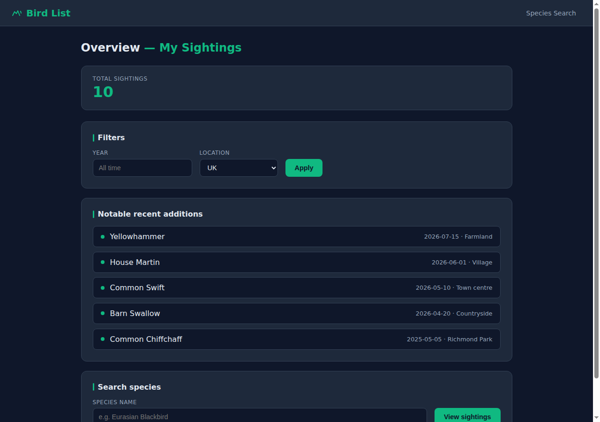

# bird-list

Groundwork for a Go web app to track bird sightings.

## Screenshot



## Features currently scaffolded

- SQLite-backed persistence for sightings
- Home page at `/` with:
  - Lifetime sighting count
  - Filter controls for year and location (`uk`, `global`, `western_palearctic`)
  - Notable recent additions (most recently added first sightings per species)
- Species search via `/species?name=...` showing all sightings for a species

## Run locally

```bash
go run ./cmd/birdlist
```

Then open `http://localhost:8080`.

Use a different port if needed:

```bash
go run ./cmd/birdlist -port 9090
```

By default, data is stored in `data/birds.db`.
Override with `BIRD_LIST_DB` if needed.
